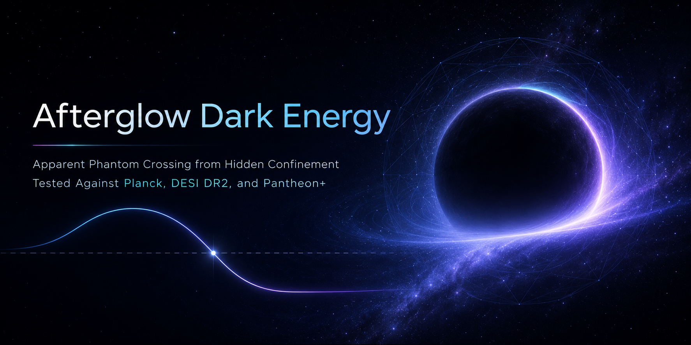

# CLASS_SYMT — Afterglow Dark Energy

An independent derivative of the CLASS Boltzmann code (not a fork)
implementing **Afterglow Dark Energy**:

> T. G. Martin and I.-G. Koh, *Afterglow Dark Energy: Apparent Phantom
> Crossing from Hidden Confinement, Tested Against Planck, DESI DR2,
> and Pantheon+*, submitted to PDU (2026). SSRN: tbd ·
> Code archive DOI: 

## The model in brief

If gravity is a macroscopic thermodynamic equation of state in
Jacobson's sense, a Lorentz-invariant equilibrium vacuum contributes no
null heat flow and drops out of the source law; cosmic acceleration
then requires a medium that is persistently out of equilibrium. This
model supplies one. A hidden pure SU(2) sector confines at a
dynamically generated meV scale, and the gapped post-confinement phase
is described causally (Müller–Israel–Stewart) by a memory variable Σ
with relaxation time c_D/H. The homogeneous branch gives ρ_X = 3c_DΣ
and an intrinsic, non-phantom equation of state

    w_X = −1 + 1/(3c_D)        (accelerating for c_D > 1/2, never phantom)

Matter loading renormalises the relaxation rate through one fixed
signed kernel,

    Ψ(r) = 4r(r−1)/(1+r)³,     r = ρ_c/ρ_X,

whose zero sits at matter–dark-energy equality. That single structure
fixes the exchange law Q = −(β/c_D) H Ψ(r) ρ_X, its sign reversal at
equality, and an effective equation of state
w_eff = −1 + [1 − βΨ(r)]/(3c_D) that can appear to cross −1 while the
physical fluid never does. One amplitude, β, carries the interaction;
the data resolve the ratio g ≡ β/c_D. Two negatives are derived rather
than assumed: the intrinsic sector cannot cross the phantom divide, and
the interaction cannot solve the coincidence problem (no fixed point of
the density-ratio flow exists below g\* ≈ 0.7).

## Status: Phase 3 constraints (2026)

Planck NPIPE CamSpec TTTEEE + low-ℓ + lensing, DESI DR2 BAO, and
Pantheon+, three converged MCMC branches (Cobaya, R−1 ≤ 6.7×10⁻³):

- the isolated β = 0 branch survives the full stack;
- g ≡ β/c_D < 0.20 at 95% credibility, set through geometry and the CMB;
- reconstructed transition amplitude ε_Σ = 0.012 (+0.023 / −0.008);
- Bayesian evidence vs ΛCDM inconclusive on all branches, |Δlog Z| < 1,
  with a mild lean toward finite c_D.

Posterior summaries, per-branch marginals, and the ledger of what these
chains do and do not support: [`phase3_summary.md`](phase3_summary.md).
The growth-channel extension (Phase 3.5) is pre-registered, with priors
fixed in the paper's Appendix F and timed to the DESI 2025–2026
releases.

## Quick start

    make clean; make -j class
    ./class afterglow.ini          # ΛCDM-compatible defaults
    python -m pytest test/         # 65 assertions, background + perturbations

Tag `afterglow` (commit `d382e60`) is the exact state behind the paper's chains.

## Repository map

- [`source/afterglow/`](source/afterglow/), [`include/afterglow/`](include/afterglow/) — the module; comments cite
  paper equations
- [`afterglow.ini`](afterglow.ini) — sample input
- [`test/test_afterglow_bg.py`](test/test_afterglow_bg.py), [`test/test_afterglow_pt.py`](test/test_afterglow_pt.py) — unit
  suite; linear-order background Bianchi residual 8.5×10⁻¹⁷
- [`README_AFTERGLOW.md`](README_AFTERGLOW.md) — parameters and design notes;
  [`PLAN_AFTERGLOW.md`](PLAN_AFTERGLOW.md) — equation-to-code map
- [`phase3_summary.md`](phase3_summary.md), [`chains_summary.json`](chains_summary.json) — results
- [`ATTRIBUTION.md`](ATTRIBUTION.md`), [`LICENSE`](LICENSE), [`README_CLASS.md`](README_CLASS.md) — upstream CLASS terms, and
  the MIT grant on the modifications, preserved verbatim.

## Explore interactively

Educational companions; open locally in a browser:

- [`afterglow_simple.html`](afterglow_simple.html) — ρ_X, p_X, w, and a, plainly
- [`afterglow_interactive_learn.html`](afterglow_interactive_learn.html) — the kernel, w_X(c_D), the exchange
- [`afterglow_class_connection.html`](afterglow_class_connection.html) — how dρ_X/dN enters the integrator
- [`phase3_branches_explorer.html`](phase3_branches_explorer.html) — posterior contours, branch by branch
- [`phase3_ym_anchor.html`](phase3_ym_anchor.html) — the β number line against the structural
  bounds 3√3/2 and 2√3
- [`phase3_geometry_lesson.html`](phase3_geometry_lesson.html) — why you pull the 2D KDE before
  storytelling

## Key equations implemented

| Eq. | Meaning |
|-----|---------|
| (4.14) | Intrinsic EoS w_X = −1 + 1/(3c_D) |
| (4.15) | Density ratio r = ρ_c/ρ_X |
| (4.18) | Signed kernel Ψ(r) |
| (4.20)–(4.21) | Loading–unloading relaxation law |
| (4.25) | Derived exchange law Q |
| (4.27)–(4.28) | Background continuity equations |
| (4.30) | Effective equation of state w_eff |
| (5.27), (5.29)–(5.31) | Stabilised closure and perturbation system |
| (5.8), (4.39) | Source-free scaling and late-time asymptotics |

In-code comments reference the working draft's numbering;
the mapping to the submitted paper is maintained in
[`PLAN_AFTERGLOW.md`](PLAN_AFTERGLOW.md).

## Conventions

Synchronous gauge, CLASS normalisations. The glue functions return
d/dN with N = ln a; relate to cosmic time by d/dt = H · d/dN.

## Citing

Publications using this code should cite the reference paper above and
CLASS II (D. Blas, J. Lesgourgues, and T. Tram, JCAP 07 (2011) 034).
Chains produced with the pipeline should also cite Cobaya (J. Torrado
and A. Lewis, JCAP 05 (2021) 057).

## License and attribution

Original CLASS portions remain under the CLASS authors' terms, free use
with citation of CLASS II; the afterglow modifications are MIT,
© 2025–2026 T. G. Martin and I.-G. Koh. See [`LICENSE`](LICENSE) and
[`ATTRIBUTION.md`](ATTRIBUTION.md).

## Contact

Tom.Martin@suffolk.edu · issues welcome via the tracker.
