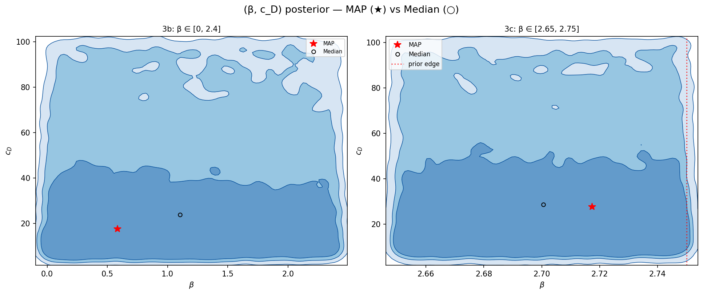
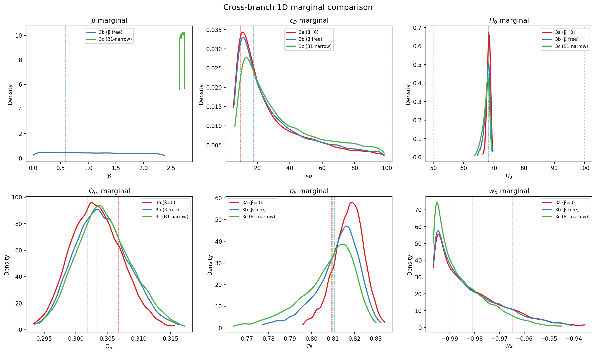
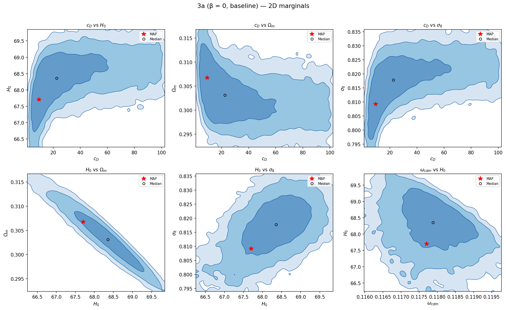
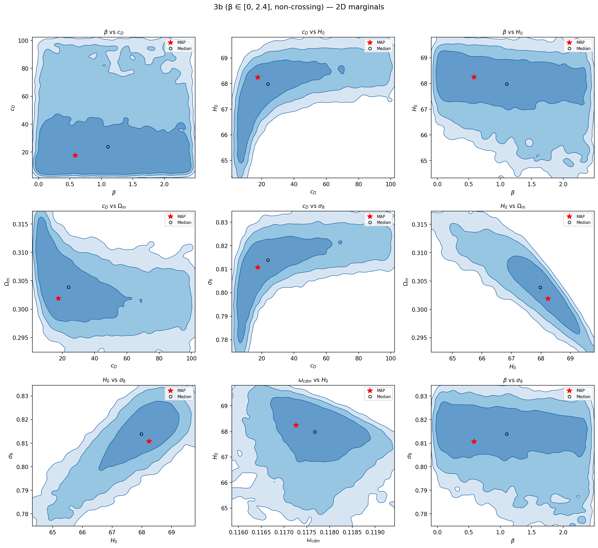
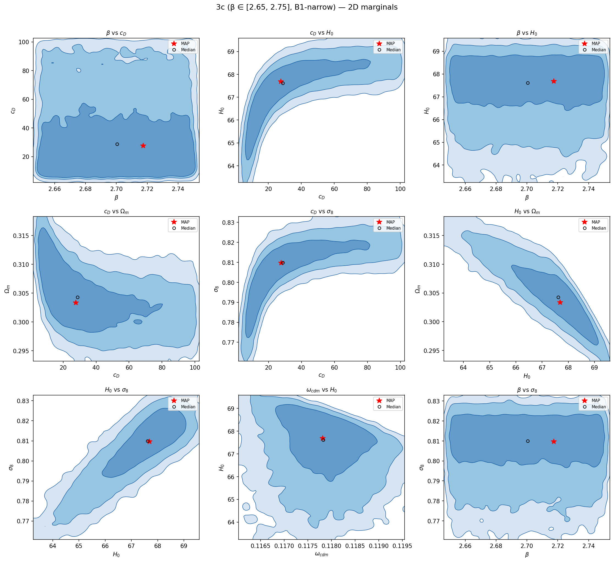

# Phase 3 posterior summary

Three pre-registered branches of the Martin–Koh Yang-Mills afterglow framework
against current data (Planck NPIPE CamSpec TTTEEE + low-ℓ + lensing, DESI DR2
BAO, Pantheon+). This page is the abstract; the styled twin
[`phase3_summary.html`](phase3_summary.html) renders the same content with
interactive touches when opened locally in a browser.

> [!NOTE]
> Data: **real chains** (final, converged) · summary exported 2026-06-02 by
> [`mcmc/export_chains_summary.py`](mcmc/export_chains_summary.py) →
> [`chains_summary.json`](chains_summary.json) · evidence numbers 2026-06-24 by
> [`mcmc/evidence_knn.py`](mcmc/evidence_knn.py) and
> [`mcmc/evidence_vs_lcdm_sddr.py`](mcmc/evidence_vs_lcdm_sddr.py).

## Headline (three things, in plain language)

1. **β on its own is unpinned; the physical coupling g is bounded.** The 3b marginal is flat across the
   full prior (0, 2.4]; the 3c marginal mirrors its narrow B1 prior. In both
   cases the posterior shape equals the prior shape, so the data has no opinion
   on β across either window. The data-resolved coupling is the ratio
   g ≡ β/c_D, bounded at **g < 0.20 (95%)** from the 3b chain (median 0.038).
2. **c_D is constrained from above.** Branch medians sit at c_D ≈ 22.7 / 23.7 /
   28.7 (3a/3b/3c) with the 95% region capped near **c_D ≲ 85–90**
   (per-branch q95: 83.5 / 85.2 / 88.1). This is the main data-driven bound.
3. **H₀, Ωₘ, σ₈, and w_X are robust across branches.** w_X is tight at
   **−0.99** (medians −0.985 / −0.986 / −0.988), effectively a cosmological
   constant, in all three branches. H₀, Ωₘ, σ₈ shift by less than ~1σ
   between branches.

**No bimodality anywhere.** Every 2D KDE is a single ridge. See the
[geometry lesson](phase3_geometry_lesson.html) for why this matters and what
the indirect-signal trap looks like.

## The three branches

| Branch | β prior | Theory rationale | What we see |
|---|---|---|---|
| **3a** baseline | β = 0 | Arrested-medium hypothesis. Isolated YM tail, no DE↔matter coupling. | Clean posterior; reference for the others. |
| **3b** non-crossing | β ∈ (0, 2.4] | Coupled, but below the structural crossing threshold β·Ψ_max > 1. | β marginal flat; non-β params look like 3a with mild shifts. |
| **3c** crossing (B1-narrow) | β ∈ [2.65, 2.75] | Inside the structurally-allowed crossing window 3√3/2 < β < 2√3. | β marginal mirrors the narrow prior; non-β params consistent with 3a/3b. |

## The money plot: (β, c_D)

Horizontal slabs in both panels. Vertical extent (c_D) is data-driven.
Horizontal extent (β) is the prior: slice horizontally at any c_D and the
likelihood is roughly constant across β. That visual is the signature of a
flat likelihood in β.

## Cross-branch 1D marginals

Six panels, three curves per panel (red = 3a, blue = 3b, green = 3c). Curves
that overlay → result is robust across branches. Curves that spread → result
depends on the β branch assumption. Only β shows large branch-dependence
(each branch has a different β prior); c_D, H₀, w_X overlay cleanly; Ωₘ and
σ₈ shift mildly within ~1σ.

## Per-branch 2D KDEs

| 3a baseline | 3b non-crossing | 3c crossing |
|---|---|---|
|  |  |  |

## What can be claimed

**Defensible Claims**

- The framework is consistent with current data across all three
  pre-registered branches.
- c_D ≲ 85–90 at 95% across all three branches (q95 = 83.5 / 85.2 / 88.1).
- w_X ≈ −0.99 across all three branches, effectively a cosmological constant
  in the data.
- g ≡ β/c_D < 0.20 at 95% credibility (3b chain, Savage–Dickey basis).
- The data does not discriminate β within any of the explored priors.

## Evidence (computed 2026-06-24)

| Quantity | Value | Method |
|---|---|---|
| log Z (3a) | −6219.38 ± 0.05 | k-NN density (Heavens 2017), k = 5, 30% burn |
| log Z (3b) | −6219.56 ± 0.02 | k-NN |
| log Z (3c) | −6219.90 ± 0.03 | k-NN |
| Δ log Z (3b − 3a) | −0.18 ± 0.05 | k-NN; consistent with zero → corroborates the flat-β finding (β buys no likelihood improvement, so Bayes' rule predicts Δ log Z ≈ 0) |
| Δ log Z vs ΛCDM (3a / 3b / 3c) | +0.53 ± 0.08 / +0.35 ± 0.06 / +0.02 ± 0.03 | Savage–Dickey density ratio at the nested point u ≡ 1+w_X = 0; k-NN cross-checks the inter-branch differences to 0.001–0.014 |

All |Δ log Z| < 1: **inconclusive on the Jeffreys scale**, with a mild lean
toward finite c_D, consistent with DESI DR2's mild dynamical-dark-energy
preference. A definitive PolyChord nested-sampling run (both models, same
likelihood stack) is staged: [`mcmc/launch_evidence_run.sh`](mcmc/launch_evidence_run.sh).

The 3b β "lower bound" 0.053 (q2.5) is prior-dominated: a percentile of a
flat marginal, not a data constraint.

---

More pages (open locally in a browser; GitHub shows their source):
[posterior explorer](phase3_branches_explorer.html) ·
[YM theory anchor](phase3_ym_anchor.html) ·
[geometry lesson](phase3_geometry_lesson.html)

Raw chains, descriptions, and the offline-capable standalone viewer are
mirrored to Drive:
[PhysicsPhD / Tom3abc](https://drive.google.com/drive/folders/1NTaQAoOLeKXfCSWkLLYfu3LSLrkwppud)
(general-access link).
